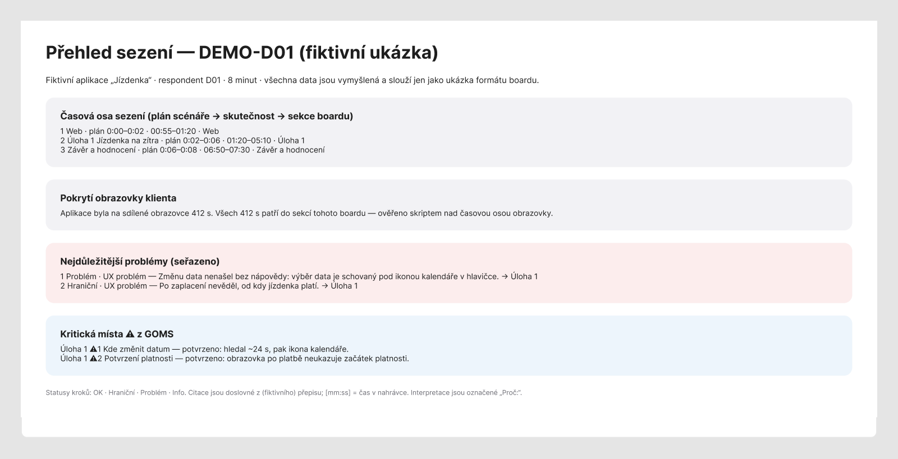
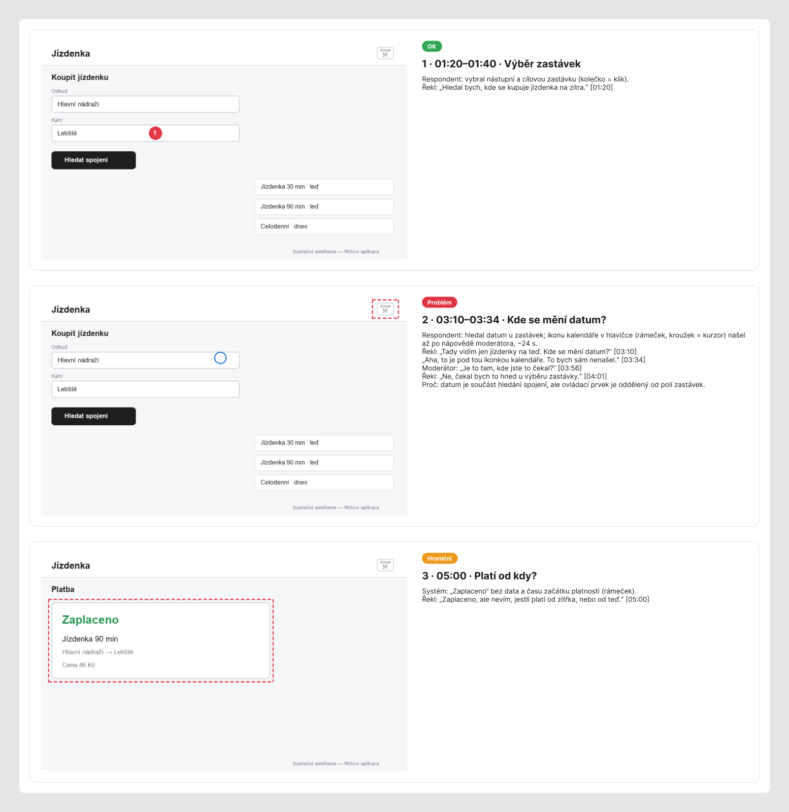
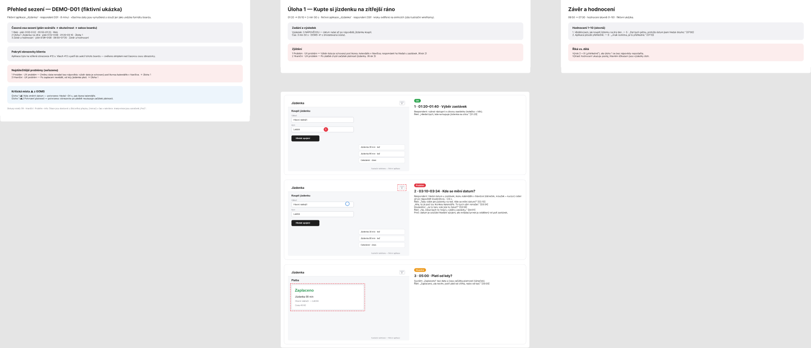

# ux-research-skills

Two [Claude Code](https://claude.com/claude-code) skills for moderated usability research, plus the
n8n plumbing and a FigJam renderer they run on:

- **`goms-testing`** — *before* the sessions: turn an app URL and a task list into a GOMS/KLM test
  design — predicted task times, method ratios (form vs chat, drag vs picker…), critical points to
  watch (⚠), an observer sheet and a Cogulator export. Output = hypotheses, never findings.
- **`ux-interview-analysis`** — *after* the sessions: turn screen-recorded sessions into client
  deliverables — a verbatim timestamped transcript, a session summary, and an observed-session board
  where every second the product is on screen is covered and every claim is checked against video
  frames. Predicted (GOMS) vs observed is part of the board.

The method lives in the skills (versioned prompts, JSON schemas, pure Python scripts). n8n only moves
files, calls Gemini and stores rows. The agent (Claude Code) is the analyst; Gemini is the perception
specialist whose output is evidence, not conclusions.

```
app URL + tasks ─► goms-testing ─► GOMS model, ⚠ critical points ─► session script
                                                                      │
recordings (Drive) ─► n8n: ingest → Gemini (transcript · screen timeline · observation · scores)
                       │                                  ▲
                       ▼                                  │ versioned prompts + schemas
                    NocoDB rows ─► ux-interview-analysis (agent): verify on frames, coverage gate,
                                   quotes inserted by script, board JSON ─► renderer (FigJam)
```

## What it looks like (fictional demo)

Everything below is **invented** — a made-up ticket app "Jízdenka", participant D01, wireframes
instead of product screenshots. No client or participant data. The board language is Czech (the
documentation language of the first study); an English version will follow. Real boards stay
private to the team and the client.

**Session overview** — timeline plan vs actual, screen coverage, ranked problems, GOMS ⚠ points
confirmed or not:



**Task walkthrough** — one card per step: screenshot with markers (numbered circle = click, ring =
cursor, dashed box = where attention must go), status, what happened, verbatim quotes with
timestamps (inserted by script, never typed), "Proč" = interpretation:



**Board layout** — one column per session block, left to right in session order; summary on top,
walkthrough below:



Reproduce the demo board JSON from the files in `.claude/skills/ux-interview-analysis/examples/demo/`:

```bash
cd .claude/skills/ux-interview-analysis && mkdir -p out
python scripts/render_quotes.py examples/demo/board.draft.txt examples/demo/transcript_rows.json --lang cs -o out/board.txt
python scripts/board_draft.py out/board.txt -o out/board.json
python scripts/figjam_code.py out/board.json --column task1 --index 1   # → use_figma
```

**GOMS output** — `klm.py` on the fictional demo model (excerpt). The method ratio is the headline,
not the seconds:

| Task | Method | Nominal (s) | Reported range |
|---|---|---:|---|
| M6.1 | D1 — Both files at once onto the empty tile | 6.6 | 5–10 s |
| M6.1 | D2 — One file at a time | 15.5 | 12–19 s |
| M6.2 | form — Form dialog | 19.4 | 15–28 s |
| M6.2 | chat — In-app AI chat | 13.8 | 11–21 s |

Ratios: D2 / D1 = **2.33** · form / chat = **1.41** (3.25 without free-text typing). These become
⚠ critical points and post-task questions in the session script.

## Repository map

| Path | What |
|---|---|
| `.claude/skills/goms-testing/` | GOMS/KLM skill: `SKILL.md`, references, templates, scripts, tests (fictional demo fixture) |
| `.claude/skills/ux-interview-analysis/` | analysis skill: `SKILL.md`, prompts, schemas, locales (`cs`, `en`), templates, scripts |
| `…/ux-interview-analysis/templates/` | study brief, session script, observer-notes guides |
| `…/ux-interview-analysis/n8n/` | setup + NocoDB tables (`README.md`), `sanitize.py`; the five workflow templates follow in the next release |
| `…/ux-interview-analysis/renderers/figjam/` | draws the board JSON in FigJam through the Figma MCP |
| `.claude/skills/skill-library-audit/` | companion: checks every package's declared resources (`resources.json`) |
| `scripts/` | discovery-link setup, user-level installer, validator |

## Agent setup

One `.claude/skills/` source serves **Claude Code, Codex, Cursor, Gemini CLI and VS Code Copilot**.
Claude Code reads it directly; for the others run once per checkout:

```bash
python scripts/setup_repo_skill_links.py
python scripts/setup_repo_skill_links.py --check
```

It creates one ignored `.agents/skills` link — never copies. `AGENTS.md` holds the shared rules;
`CLAUDE.md` and `GEMINI.md` import it. To use the skills in other projects:
`python scripts/install_user_skills.py` (links into `~/.claude/skills` and `~/.agents/skills`).
Details and limits: [docs/agent-setup.md](docs/agent-setup.md).

## Validation

```bash
python scripts/validate_skills.py
python -B .claude/skills/skill-library-audit/scripts/audit_library.py --skills-root .claude/skills
python -m pytest .claude/skills/goms-testing/tests -q
```

## Requirements

- An agent that runs skills, reads images (frame verification is not optional) and calls MCP
  servers — built with Claude Code.
- Python 3.10+, `pip install -r requirements.txt`; `ffmpeg` on PATH (frames).
- For the analysis: self-hosted **n8n**, **NocoDB**, a **Google Drive** OAuth credential, a
  **Gemini API** key (paid usage), and for the board the **Figma MCP** with an editable FigJam file.
- Optional: Playwright (GOMS `measure_r.py`), Obsidian + the free Time Bullet plugin (observer notes).

## What a session costs (measured, one 43-minute session)

17 Gemini calls: ~1.30 M input tokens and ~79 k output tokens (transcript 5 × 10-min windows
238 k in; screen timeline 151 k; step observation 900 k — 2 fps at high resolution, ~69 % of the
input; spoken-score check 15 k). Multiply by your model's price. The agent's own time (frame
verification, writing, building the board) is the larger cost and is not included.

## Honest limits

- **Validated once.** One study; one 43-minute session processed end to end (transcript, summary,
  full board, 100 % screen coverage). This is a working method, not a benchmark.
- **Gemini is wrong in specific ways.** Timestamps off by up to a minute; URL/OCR fields unreliable;
  it reported tooltips that are on no frame. Every claim that reaches a deliverable is checked on a
  frame by the agent — skip that and you publish hallucinations.
- **Model- and language-specific tuning.** Prompts were tuned on one Gemini Flash model; others are
  untested. The transcript prompt is language-neutral but only Czech sessions have run; the English
  locale has not met a real session. Board labels in our run were Czech (English labels are accepted).
- **Transcripts are machine-made** (3 speakers, overlaps marked) and were not human-verified.
- **One renderer.** FigJam only. Participants can't edit FigJam boards without a Figma login — never
  put participant input (rating cards, exercises) there; test every participant link in a private
  window first.
- **Not packaged yet:** the observer-notes aligner (note time → recording time), the filled
  rating-card visual and board restructuring scripts (done ad hoc in our run), cross-participant
  synthesis.
- **GOMS** outputs hypotheses; its tests pin the KLM arithmetic, not the validity of a model.
  Desktop web only.
- **Security:** the webhooks share one static API key checked in an IF node (our house pattern) —
  prefer n8n's Header Auth. Recordings contain faces and names: crop to the shared screen, keep
  participant data out of repos, and check consent, GDPR and your Gemini plan's data-use terms
  yourself.

## License

MIT — see `LICENSE`. Built by Rostislav Peška; adapt it to your workflow.
