# ux-research-skills

Two [Claude Code](https://claude.com/claude-code) skills for moderated usability research, plus the
n8n plumbing and a FigJam renderer they run on:

- **`goms-testing`** — *before* the sessions: turn an app URL and a task list into a GOMS/KLM test
  design — predicted task times, method ratios (form vs chat, drag vs picker…), critical points to
  watch (⚠), an observer sheet and a Cogulator export. Output = hypotheses, never findings.
- **`ux-interview-analysis`** — *after* the sessions: turn screen-recorded sessions into client
  deliverables — a verbatim timestamped transcript, a session summary, and an observed-session board
  where every second the product is on screen is covered and every claim is checked against video
  frames. Predicted (GOMS) vs observed is part of the board.

The method lives in the skills (versioned prompts, JSON schemas, pure Python scripts). n8n only moves
files, calls Gemini and stores rows. The agent (Claude Code) is the analyst; Gemini is the perception
specialist whose output is evidence, not conclusions.

```
app URL + tasks ─► goms-testing ─► GOMS model, ⚠ critical points ─► session script
                                                                      │
recordings (Drive) ─► n8n: ingest → Gemini (transcript · screen timeline · observation · scores)
                       │                                  ▲
                       ▼                                  │ versioned prompts + schemas
                    NocoDB rows ─► ux-interview-analysis (agent): verify on frames, coverage gate,
                                   quotes inserted by script, board JSON ─► renderer (FigJam)
```

## What it looks like — one GOMS board, one testing board

Everything in this section is **invented**: a made-up train-ticket app "Railo" and a fictional
participant P03, a weekday commuter who thinks aloud in Czech. The boards are in English; her
quotes stay verbatim in Czech with an English translation underneath. Both boards were built with
this repo's scripts and FigJam renderer (texts hash-checked, screens = mock-ups of the fictional
app). Real client boards stay private.

**The task:** *buy a ticket Prague → Brno for tomorrow around 7:30, window seat.* Two ways to do it:
the search form, or the app's AI assistant.

### 1 · GOMS — predict before anyone tests

GOMS calls it a tie (form 23.1 s, assistant 22.7 s), and it marks the places where the form could
break — the ⚠ critical points that the session script then watches.

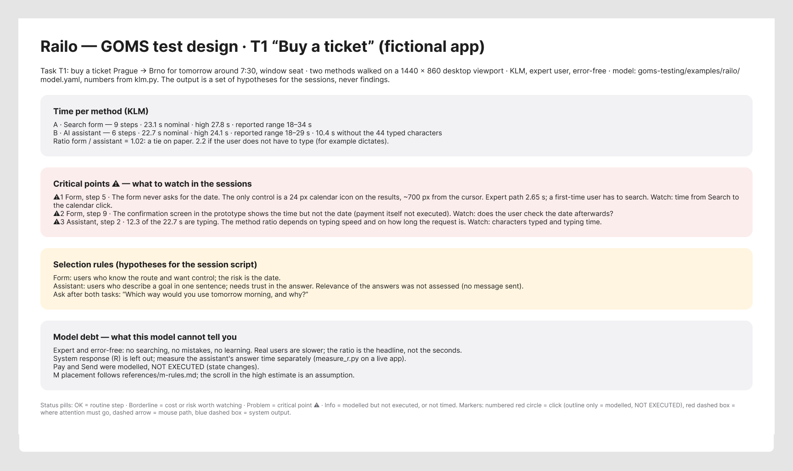

Where the seconds go: the form pays in decisions and pointing, the assistant pays in typing.

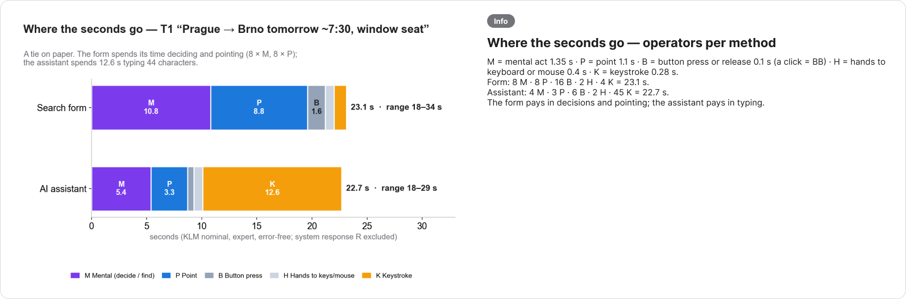

Every step of every method gets a card: what the user does, the KLM operators → seconds and the
cumulative time, the mouse path, where attention must go, and why. Step 5 is the risk — the form
never asks for the date, and the only date control is a 24 px icon:

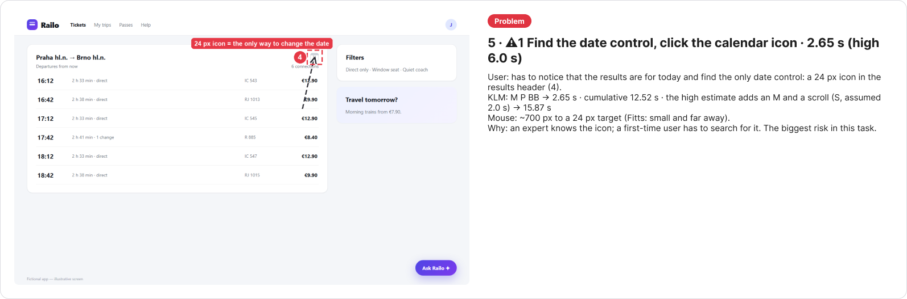

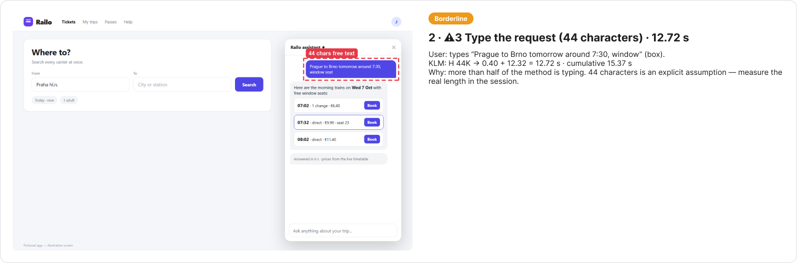

`klm.py` output for the model ([`examples/railo/model.yaml`](.claude/skills/goms-testing/examples/railo/model.yaml)):

| Task | Method | Nominal (s) | High (s) | Reported range | Without free text (s) |
|---|---|---:|---:|---|---:|
| T1 | form — Search form | 23.1 | 27.8 | 18–34 s | 23.1 |
| T1 | chat — AI assistant | 22.7 | 24.1 | 18–29 s | 10.4 |

Ratio form / assistant = **1.02** (2.23 without the typing). The method ratio and the ⚠ points are
the output, not the seconds: an expert, error-free model predicts *where to look*, never what users do.

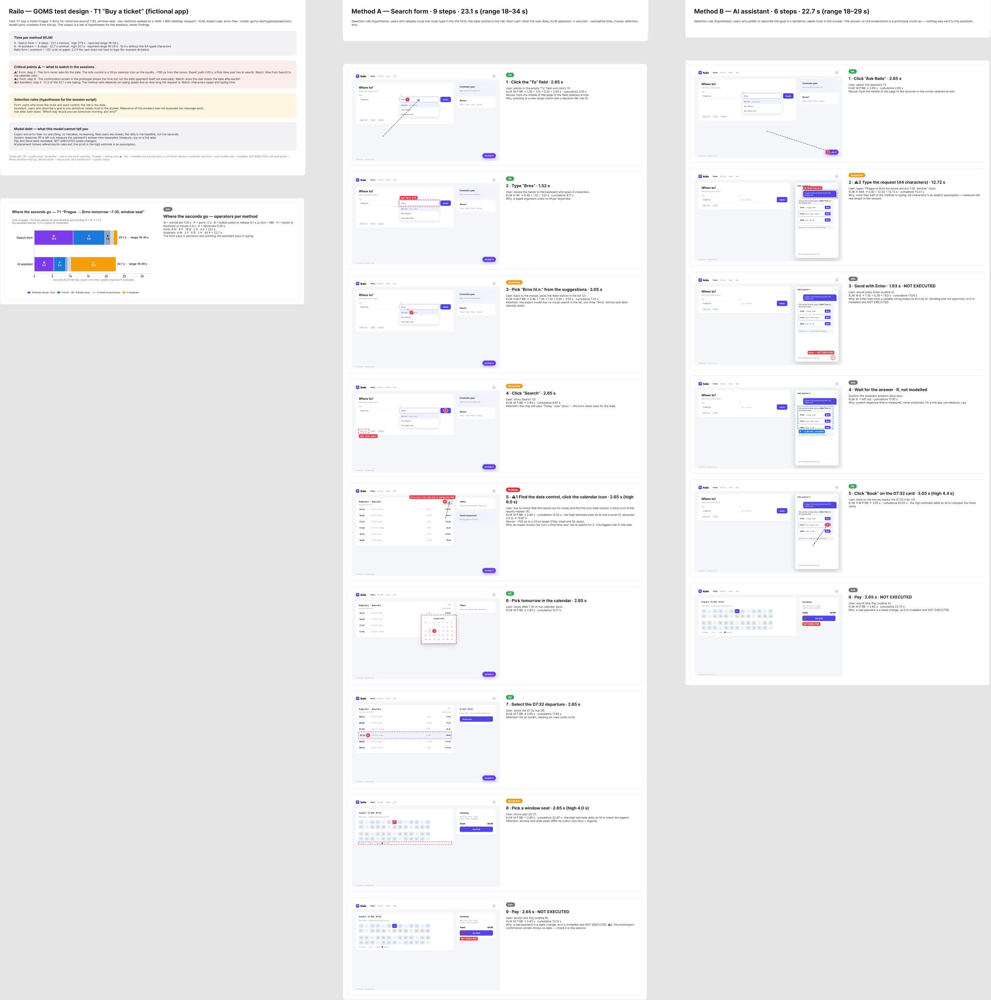

### 2 · Testing — what the session actually showed

The session board starts with the verdict: timeline (script plan → actual → board section), screen
coverage, ranked problems, each GOMS ⚠ point confirmed or not, and where what she *said* differs
from what she *did*.

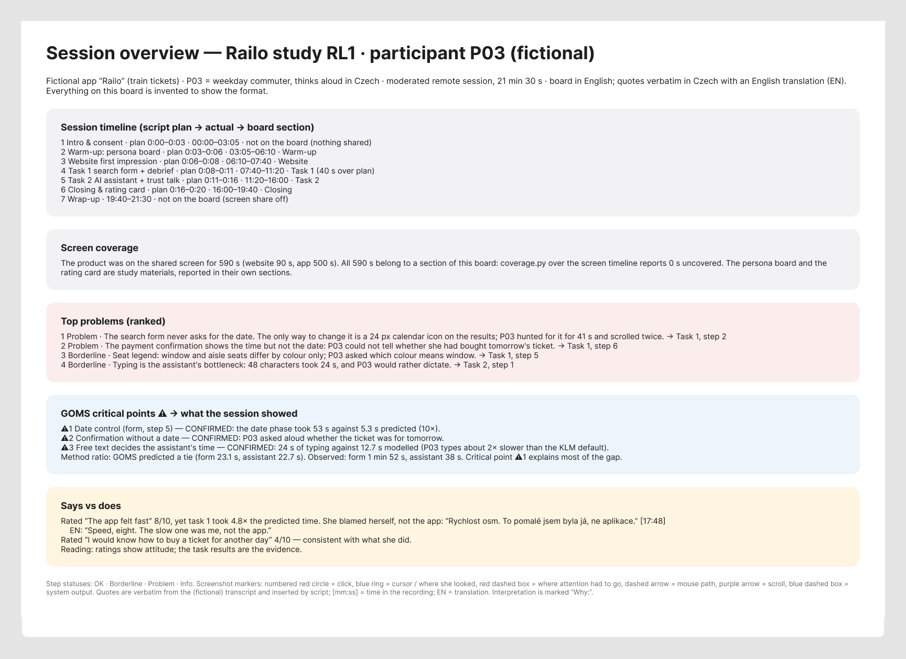

GOMS called a tie; the session did not. The date phase took **53 s against 5.3 s predicted** —
critical point ⚠1, exactly where the model said to look.

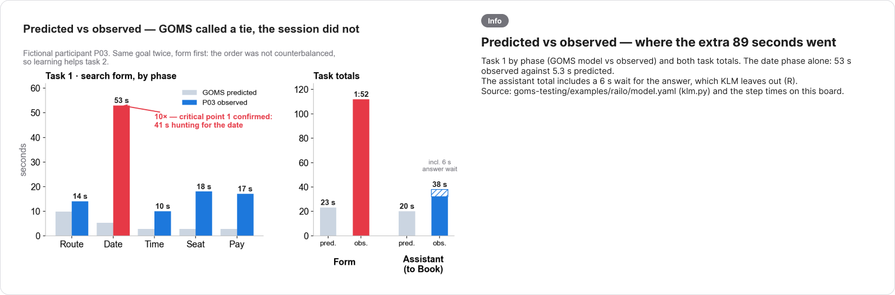

Every step: an annotated screenshot (numbered circle = click, blue ring = where she looked, dashed
box = where attention had to go, purple arrow = scroll), a status, what happened with timestamps,
**verbatim quotes inserted by script — never typed** — with the translation, and the interpretation
marked "Why:".

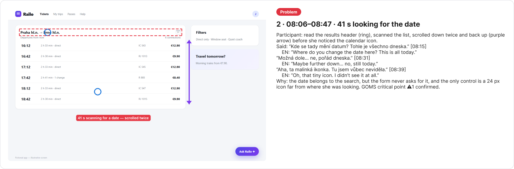

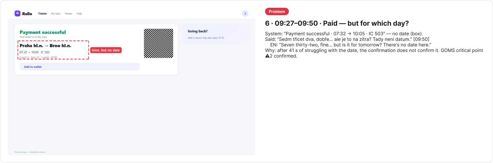

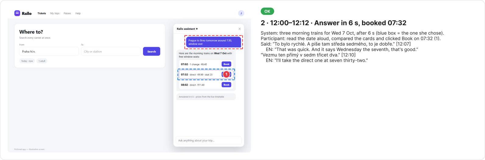

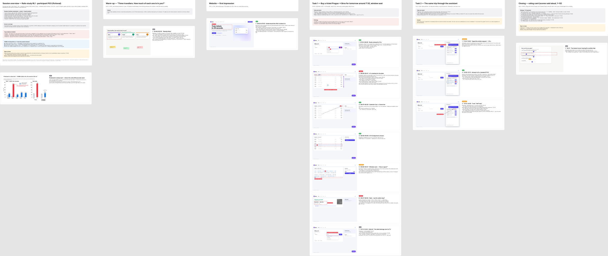

### Reproduce the demo

The inputs are in [`ux-interview-analysis/examples/railo/`](.claude/skills/ux-interview-analysis/examples/railo/)
(board drafts, transcript rows with `text_en`, screen timeline, session map):

```bash
cd .claude/skills/goms-testing
python scripts/klm.py --md examples/railo/model.yaml          # GOMS numbers
cd ../ux-interview-analysis && mkdir -p out
python scripts/coverage.py examples/railo/timeline_runs.json examples/railo/session_map.json   # 590 of 590 s
python scripts/render_quotes.py examples/railo/session_board.draft.txt examples/railo/transcript_rows.json \
  --lang en --translation text_en -o out/session.txt         # 28 quotes, Czech + EN
python scripts/board_draft.py out/session.txt -o out/session.json
python scripts/board_draft.py examples/railo/goms_board.draft.txt -o out/goms.json
python scripts/figjam_code.py out/session.json --column task1 --index 3   # → use_figma, one call per column
```

In a real run the screenshots come from the recording (`frames.py`) and every claim is checked on a
video frame. The demo's mock screens and the two charts were made by hand for this README.

## Repository map

| Path | What |
|---|---|
| `.claude/skills/goms-testing/` | GOMS/KLM skill: `SKILL.md`, references, templates, scripts, tests; `examples/` = fictional models (test fixture + the Railo demo) |
| `.claude/skills/ux-interview-analysis/` | analysis skill: `SKILL.md`, prompts, schemas, locales (`cs`, `en`), templates, scripts |
| `…/ux-interview-analysis/templates/` | study brief, session script, observer-notes guides |
| `…/ux-interview-analysis/examples/railo/` | inputs of the fictional demo boards above |
| `…/ux-interview-analysis/n8n/` | the five workflow templates (`workflows/`), install guide (`INSTALL.md`), NocoDB tables + limits (`README.md`), `sanitize.py` |
| `…/ux-interview-analysis/renderers/figjam/` | draws the board JSON in FigJam through the Figma MCP |
| `.claude/skills/skill-library-audit/` | companion: checks every package's declared resources (`resources.json`) |
| `scripts/` | discovery-link setup, user-level installer, validator |

## Agent setup

One `.claude/skills/` source serves **Claude Code, Codex, Cursor, Gemini CLI and VS Code Copilot**.
Claude Code reads it directly; for the others run once per checkout:

```bash
python scripts/setup_repo_skill_links.py
python scripts/setup_repo_skill_links.py --check
```

It creates one ignored `.agents/skills` link — never copies. `AGENTS.md` holds the shared rules;
`CLAUDE.md` and `GEMINI.md` import it. To use the skills in other projects:
`python scripts/install_user_skills.py` (links into `~/.claude/skills` and `~/.agents/skills`).
Details and limits: [docs/agent-setup.md](docs/agent-setup.md).

## Validation

```bash
python scripts/validate_skills.py
python -B .claude/skills/skill-library-audit/scripts/audit_library.py --skills-root .claude/skills
python -m pytest .claude/skills/goms-testing/tests -q
```

## Requirements

- An agent that runs skills, reads images (frame verification is not optional) and calls MCP
  servers — built with Claude Code.
- Python 3.10+, `pip install -r requirements.txt`; `ffmpeg` on PATH (frames).
- For the analysis (install guide: [n8n/INSTALL.md](.claude/skills/ux-interview-analysis/n8n/INSTALL.md)): self-hosted **n8n**, **NocoDB**, a **Google Drive** OAuth credential, a
  **Gemini API** key (paid usage), and for the board the **Figma MCP** with an editable FigJam file.
- Optional: Playwright (GOMS `measure_r.py`), Obsidian + the free Time Bullet plugin (observer notes).

## What a session costs (measured, one 43-minute session)

17 Gemini calls: ~1.30 M input tokens and ~79 k output tokens (transcript 5 × 10-min windows
238 k in; screen timeline 151 k; step observation 900 k — 2 fps at high resolution, ~69 % of the
input; spoken-score check 15 k). Multiply by your model's price. The agent's own time (frame
verification, writing, building the board) is the larger cost and is not included.

## Honest limits

- **Validated once.** One study; one 43-minute session processed end to end (transcript, summary,
  full board, 100 % screen coverage). This is a working method, not a benchmark.
- **Gemini is wrong in specific ways.** Timestamps off by up to a minute; URL/OCR fields unreliable;
  it reported tooltips that are on no frame. Every claim that reaches a deliverable is checked on a
  frame by the agent — skip that and you publish hallucinations.
- **Model- and language-specific tuning.** Prompts were tuned on one Gemini Flash model; others are
  untested. The transcript prompt is language-neutral but only Czech sessions have run; the English
  locale has not met a real session. Board labels in our run were Czech (English labels are accepted).
- **Transcripts are machine-made** (3 speakers, overlaps marked) and were not human-verified.
- **One renderer.** FigJam only. Participants can't edit FigJam boards without a Figma login — never
  put participant input (rating cards, exercises) there; test every participant link in a private
  window first.
- **Not packaged yet:** the observer-notes aligner (note time → recording time), the filled
  rating-card visual and board restructuring scripts (done ad hoc in our run), cross-participant
  synthesis.
- **GOMS** outputs hypotheses; its tests pin the KLM arithmetic, not the validity of a model.
  Desktop web only.
- **Security:** the webhooks share one static API key checked in an IF node (our house pattern) —
  prefer n8n's Header Auth. Recordings contain faces and names: crop to the shared screen, keep
  participant data out of repos, and check consent, GDPR and your Gemini plan's data-use terms
  yourself.

## License

MIT — see `LICENSE`. Built by Rostislav Peška; adapt it to your workflow.
